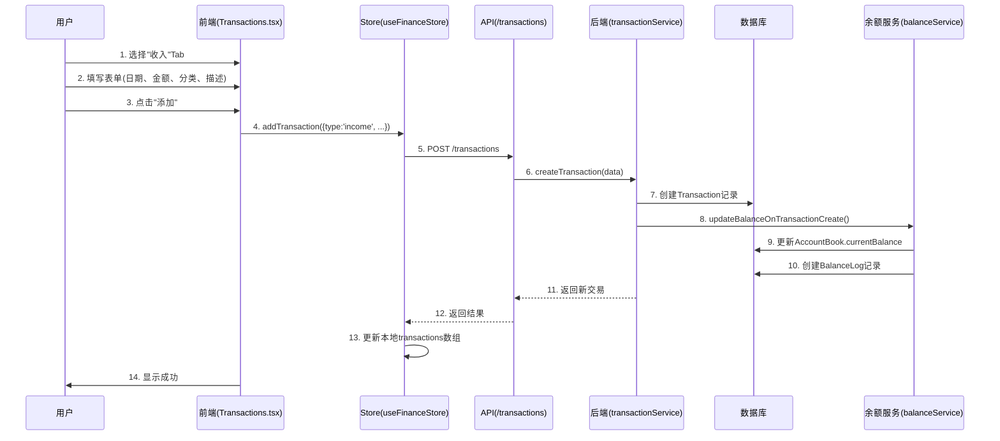
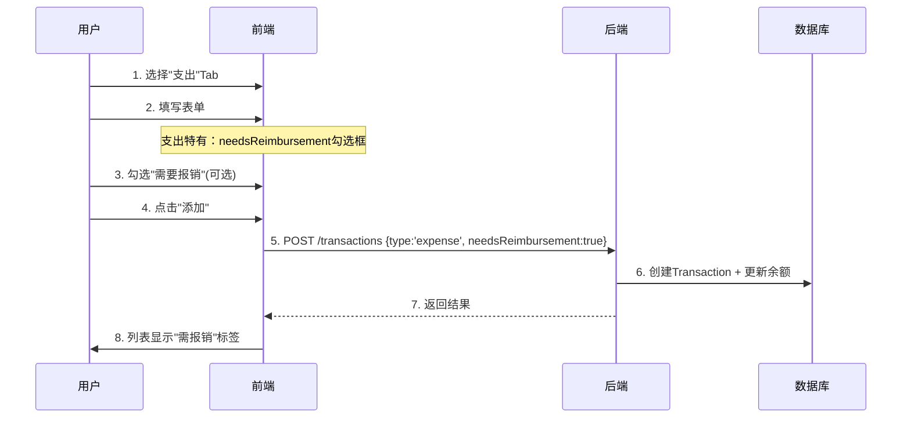
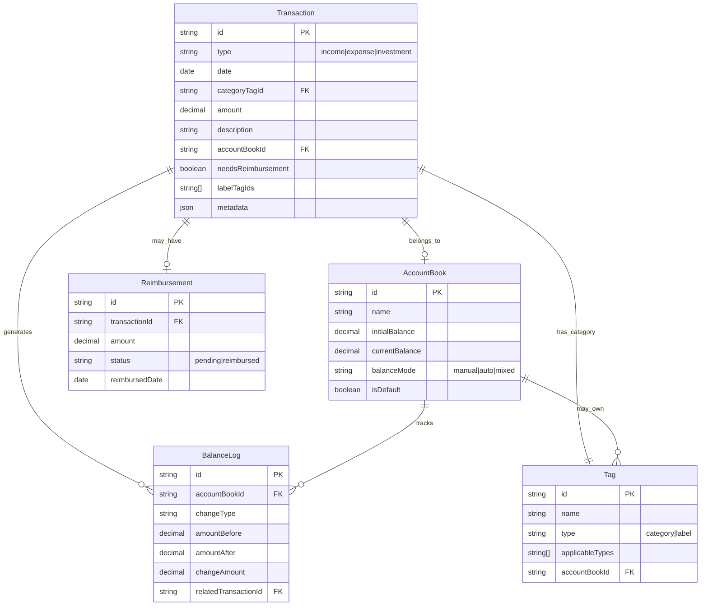
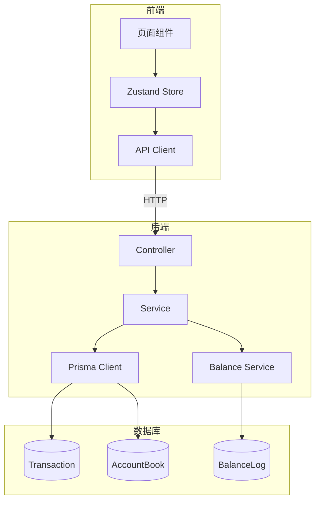
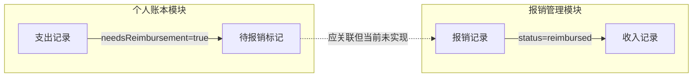

# 个人账本模块业务分析

> **分析日期**: 2025-11-25
> **模块定位**: 记录收入和支出，并标记需要报销的交易
> **技术栈**: React + Express + PostgreSQL + Prisma

---

## 1. 模块概述

### 1.1 定位与价值

个人账本模块是整个多账本财务管理系统的**核心基础模块**，提供最基本也最重要的功能：

- **记录收入**：追踪所有资金来源（工资、奖金、投资收益等）
- **记录支出**：追踪所有资金去向（餐饮、交通、购物等）
- **报销标记**：标识哪些支出可以向公司或他人报销

### 1.2 核心功能

| 功能 | 描述 | 状态 |
|------|------|------|
| 记录收入 | 记录日期、金额、分类、描述、所属账本 | ✅ 完整 |
| 记录支出 | 记录日期、金额、分类、描述、是否需报销 | ✅ 完整 |
| 报销标记 | 在支出上标记"需要报销" | ✅ 完整 |
| 余额跟踪 | 自动/手动计算账本余额 | ✅ 完整 |
| 多账本支持 | 支出/收入可归属不同账本 | ✅ 完整 |
| 分类标签 | 通过标签系统分类交易 | ✅ 完整 |

### 1.3 适用场景

1. **日常记账**：记录每天的收入和支出
2. **预算控制**：通过分类了解消费结构
3. **报销管理**：标记可报销的工作相关支出
4. **多账本管理**：个人账本、家庭账本、公司账本分开记录

---

## 2. 功能详解

### 2.1 记录收入

#### 业务流程



#### 数据模型

收入通过统一的 `Transaction` 表存储，`type = 'income'`：

```typescript
// 前端类型定义 (frontend/src/store/types.ts:298-332)
interface Transaction {
  id: string
  type: 'income' | 'expense' | 'investment'  // 收入时为 'income'
  date: string
  categoryTagId: string     // 必填：收入分类（如工资、奖金）
  amount: number            // 金额
  description: string       // 描述
  accountBookId?: string    // 可选：所属账本
  note?: string             // 可选：备注
  createdAt: string
  updatedAt: string
}
```

#### API 接口

```
POST /api/transactions
Content-Type: application/json

{
  "type": "income",
  "date": "2025-11-25",
  "categoryTagId": "uuid-of-category-tag",
  "amount": 10000,
  "description": "11月工资",
  "accountBookId": "uuid-of-account-book"  // 可选
}
```

#### 前端交互

- **入口**：`/transactions` 页面 → "收入" Tab
- **表单字段**：日期、金额、描述、分类、备注
- **提交后**：列表自动刷新，显示新记录

---

### 2.2 记录支出

#### 业务流程

与收入类似，但支出有额外的特有字段：



#### 数据模型

支出使用 `Transaction` 表，`type = 'expense'`，有额外字段：

```typescript
interface Transaction {
  // ... 基础字段同上
  type: 'expense'

  // Expense 特有字段
  needsReimbursement?: boolean   // 是否需要报销
  labelTagIds?: string[]         // 普通标签（如"可报销"、"紧急"）
  receiptPhoto?: string          // 发票照片URL
  location?: string              // 消费地点
}
```

#### API 接口

```
POST /api/transactions
Content-Type: application/json

{
  "type": "expense",
  "date": "2025-11-25",
  "categoryTagId": "uuid-餐饮",
  "amount": 50,
  "description": "工作午餐",
  "needsReimbursement": true,    // 标记需报销
  "accountBookId": "uuid-工作账本"
}
```

#### 前端交互

- **表单差异**：支出Tab多一个"需要报销"勾选框
- **列表显示**：需报销的记录会显示"需报销"标签徽章
- **代码位置**：`frontend/src/pages/Transactions.tsx:450-468`

```tsx
{/* 支出特有字段 */}
{formData.type === 'expense' && (
  <div className="flex items-center space-x-2">
    <input
      type="checkbox"
      id="needsReimbursement"
      checked={formData.needsReimbursement}
      onChange={(e) =>
        setFormData({ ...formData, needsReimbursement: e.target.checked })
      }
    />
    <Label htmlFor="needsReimbursement">需要报销</Label>
  </div>
)}
```

---

### 2.3 报销标记

#### 什么是"需要报销"？

当用户产生了一笔支出，但这笔支出可以从公司或其他人那里获得报销时，用户可以将其标记为"需要报销"。

**典型场景**：
- 员工垫付的差旅费用
- 为公司购买的办公用品
- 可以找他人分摊的聚餐费用

#### 如何标记？

**方式1：创建时标记**

在创建支出时，勾选"需要报销"复选框。

**方式2：编辑时标记**

点击已有支出的编辑按钮，勾选"需要报销"。

```typescript
// 更新交易 (frontend/src/store/useFinanceStore.ts:951-955)
updateTransaction: async (id, transaction) => {
  const updated = await transactionsApi.update(id, transaction)
  set(state => ({
    transactions: state.transactions.map(t => t.id === id ? updated : t)
  }))
}
```

#### 标记后的后续流程

```mermaid
graph LR
    A[支出 needsReimbursement=true] --> B[显示"需报销"标签]
    B --> C[用户去报销页面]
    C --> D[手动创建报销记录]
    D --> E[等待报销到账]
    E --> F[标记报销完成]
```

#### 与报销管理模块的关系

**当前实现状态**：

| 功能 | 状态 | 说明 |
|------|------|------|
| 标记支出需报销 | ✅ 完成 | Transaction.needsReimbursement |
| 查询需报销支出 | ✅ 完成 | API支持 needsReimbursement 筛选 |
| 自动创建报销单 | ❌ 未实现 | 需手动在报销页面创建 |
| 报销单关联支出 | ⚠️ 部分 | Schema支持但前端未联动 |
| 报销完成生成收入 | ❌ 未实现 | 需手动记录收入 |

**Schema 设计（支持但未完全实现）**：

```prisma
// backend/prisma/schema.prisma:39-57
model Reimbursement {
  id              String    @id @default(uuid())
  transactionId   String?   @unique  // 可关联到Transaction
  status          String    @default("pending")

  transaction     Transaction?  @relation("TransactionReimbursement",
                                fields: [transactionId], references: [id])
}
```

---

## 3. 数据模型

### 3.1 核心表结构



### 3.2 关键字段说明

#### Transaction 表

| 字段 | 类型 | 必填 | 说明 |
|------|------|------|------|
| id | UUID | 是 | 主键 |
| type | String | 是 | 交易类型：'income', 'expense', 'investment' |
| date | Date | 是 | 交易日期 |
| categoryTagId | UUID | 是 | 分类标签ID |
| amount | Decimal(12,2) | 是 | 金额 |
| description | String(255) | 是 | 描述 |
| accountBookId | UUID | 否 | 所属账本，null表示未归属 |
| needsReimbursement | Boolean | 否 | 是否需报销（仅expense有效） |
| labelTagIds | String[] | 否 | 普通标签ID数组 |
| note | Text | 否 | 备注 |
| metadata | JSON | 否 | 扩展数据（主要用于investment） |

#### AccountBook 表

| 字段 | 类型 | 说明 |
|------|------|------|
| initialBalance | Decimal | 初始余额，创建时设置 |
| currentBalance | Decimal | 当前余额，根据balanceMode自动或手动更新 |
| balanceMode | String | 余额模式：manual(手动), auto(自动), mixed(混合) |
| isDefault | Boolean | 是否为默认账本，系统必须有一个 |

### 3.3 表关系说明

#### Transaction ↔ AccountBook

- **关系类型**：多对一（可选）
- **规则**：Transaction.accountBookId 可以为 null
- **删除行为**：删除账本时，关联交易的 accountBookId 设为 null（onDelete: SetNull）

```prisma
// backend/prisma/schema.prisma:278
accountBook AccountBook? @relation(fields: [accountBookId],
                                  references: [id], onDelete: SetNull)
```

#### Transaction ↔ Tag (Category)

- **关系类型**：多对一（必填）
- **规则**：每个交易必须有一个分类标签
- **验证**：标签的 applicableTypes 必须包含交易的 type
- **删除行为**：禁止删除被使用的分类标签（onDelete: Restrict）

```typescript
// 验证逻辑 (backend/src/services/transactionService.ts:77-94)
if (data.categoryTagId && data.type) {
  const categoryTag = await tx.tag.findUnique({
    where: { id: data.categoryTagId as string },
  })

  if (categoryTag.applicableTypes.length > 0) {
    if (!categoryTag.applicableTypes.includes(data.type)) {
      throw new Error(`分类标签不适用于该交易类型`)
    }
  }
}
```

#### Transaction ↔ Reimbursement

- **关系类型**：一对一（可选）
- **规则**：一个支出最多关联一个报销记录
- **删除行为**：删除交易时，解除与报销的关联（设为null）

```typescript
// 删除时处理 (backend/src/services/transactionService.ts:240-246)
if (transaction?.reimbursement) {
  await tx.reimbursement.update({
    where: { id: transaction.reimbursement.id },
    data: { transactionId: null },
  })
}
```

---

## 4. 技术架构

### 4.1 后端架构

```
backend/
├── prisma/
│   └── schema.prisma          # 数据模型定义
├── src/
│   ├── config/
│   │   └── database.ts        # Prisma 客户端配置
│   ├── services/
│   │   ├── transactionService.ts   # 交易业务逻辑 ⭐核心
│   │   ├── balanceService.ts       # 余额管理 ⭐核心
│   │   ├── reimbursementService.ts # 报销业务逻辑
│   │   └── accountBookService.ts   # 账本业务逻辑
│   ├── controllers/
│   │   ├── transactionController.ts # 交易HTTP处理
│   │   ├── reimbursementController.ts
│   │   └── accountBookController.ts
│   └── routes/
│       └── *.ts               # 路由定义
```

#### Service 层职责

| Service | 核心职责 | 关键方法 |
|---------|----------|----------|
| transactionService | 交易CRUD，标签计数维护 | createTransaction, updateTransaction, deleteTransaction |
| balanceService | 余额计算与记录 | updateBalanceOnTransactionCreate/Update/Delete |
| reimbursementService | 报销记录CRUD | updateReimbursementStatus |
| accountBookService | 账本管理 | setDefaultAccountBook |

#### Controller 层职责

- 请求参数验证
- 调用Service方法
- 统一响应格式：`{ success: boolean, data?: any, error?: string }`

### 4.2 前端架构

```
frontend/src/
├── pages/
│   ├── Transactions.tsx       # 交易管理页面 ⭐核心
│   ├── Reimbursement.tsx      # 报销管理页面
│   └── Dashboard.tsx          # 仪表盘（收支概览）
├── store/
│   ├── useFinanceStore.ts     # Zustand状态管理 ⭐核心
│   └── types.ts               # TypeScript类型定义
├── api/
│   ├── transactions.ts        # 交易API调用
│   ├── reimbursements.ts      # 报销API调用
│   └── client.ts              # Axios封装
└── components/
    └── ui/                    # shadcn/ui组件
```

#### 页面结构

**Transactions.tsx** (819行)

```
┌─────────────────────────────────────────┐
│  页面标题                 [添加交易]按钮  │
├─────────────────────────────────────────┤
│  [支出] [收入] [投资]  ← Tab切换          │
├─────────────────────────────────────────┤
│  统计卡片: 总计 | 笔数 | 平均 | 最大      │
├─────────────────────────────────────────┤
│  搜索框 | 时间筛选 | 分类筛选             │
│  [高级筛选按钮]                          │
├─────────────────────────────────────────┤
│  交易列表                                │
│  ┌───────────────────────────────────┐ │
│  │ 🍔 午餐           ¥50    [编辑][删除]│ │
│  │ 11-25 • 餐饮 [需报销]              │ │
│  └───────────────────────────────────┘ │
├─────────────────────────────────────────┤
│  分类统计饼图                            │
└─────────────────────────────────────────┘
```

#### 状态管理

**useFinanceStore** 关键状态和方法：

```typescript
interface FinanceStore {
  // 数据
  transactions: Transaction[]
  expenses: Expense[]           // 兼容旧数据
  incomes: Income[]             // 兼容旧数据
  reimbursements: Reimbursement[]
  accountBooks: AccountBook[]
  tags: Tag[]

  // 统计
  stats: {
    pendingReimbursement: number  // 待报销金额
    // ...
  }

  // 核心方法
  loadData: () => Promise<void>
  addTransaction: (t) => Promise<string>
  updateTransaction: (id, t) => Promise<void>
  deleteTransaction: (id) => Promise<void>

  // 辅助方法
  getCategoryTags: () => Tag[]
  getTagById: (id) => Tag | undefined
}
```

### 4.3 API 设计

#### Transaction API（主要使用）

| 方法 | 端点 | 说明 |
|------|------|------|
| GET | /api/transactions | 获取列表（支持筛选） |
| GET | /api/transactions/:id | 获取单个 |
| POST | /api/transactions | 创建 |
| PUT | /api/transactions/:id | 更新 |
| DELETE | /api/transactions/:id | 删除 |
| GET | /api/transactions/stats | 统计数据 |

**筛选参数**：
- `type`: 'income' | 'expense' | 'investment'
- `accountBookId`: 账本ID
- `categoryTagId`: 分类标签ID
- `startDate`, `endDate`: 日期范围
- `needsReimbursement`: true | false

#### 响应格式

```json
// 成功
{
  "success": true,
  "data": { /* 数据 */ }
}

// 失败
{
  "success": false,
  "error": "错误信息"
}
```

### 4.4 数据流向



---

## 5. 业务规则

### 5.1 数据验证

#### 金额验证

```typescript
// 前端验证 (Transactions.tsx:361-370)
<Input
  type="number"
  step="0.01"           // 支持2位小数
  required              // 必填
/>

// 后端验证 (transactionController.ts:68-74)
if (!transactionData.amount) {
  return res.status(400).json({
    success: false,
    error: 'Missing required fields',
  })
}
```

#### 必填字段

| 字段 | 前端验证 | 后端验证 |
|------|----------|----------|
| type | 默认值 | ✅ 必填 |
| date | required | ✅ 必填 |
| amount | required | ✅ 必填 |
| description | required | ✅ 必填 |
| categoryTagId | required | ✅ 必填 |

#### 分类标签验证

```typescript
// 验证标签适用类型 (transactionService.ts:88-94)
if (categoryTag.applicableTypes.length > 0) {
  if (!categoryTag.applicableTypes.includes(data.type)) {
    throw new Error(`分类标签"${categoryTag.name}"不适用于${typeLabel}交易`)
  }
}
```

### 5.2 业务约束

#### 收入/支出的区分规则

| 类型 | 余额影响 | 特有字段 |
|------|----------|----------|
| income | +amount | 无 |
| expense | -amount | needsReimbursement, labelTagIds, receiptPhoto, location |
| investment(buy) | -amount | subType, metadata |
| investment(sell) | +amount | subType, metadata |

```typescript
// 余额计算逻辑 (balanceService.ts:27-48)
export const calculateBalanceChange = (
  type: TransactionType,
  subType: string | null,
  amount: Decimal,
  currentBalance: Decimal
): Decimal => {
  switch (type) {
    case 'income':
      return currentBalance.add(amount)
    case 'expense':
      return currentBalance.sub(amount)
    case 'investment':
      if (subType === 'buy') return currentBalance.sub(amount)
      if (subType === 'sell') return currentBalance.add(amount)
      return currentBalance
  }
}
```

#### 报销标记的限制

- 只有 `type = 'expense'` 的交易可以设置 `needsReimbursement`
- 一个支出只能关联一个报销记录（Schema层约束：`transactionId @unique`）

#### 账本关联的规则

- 交易可以不关联账本（`accountBookId = null`）
- 删除账本不会删除交易（只是解除关联）
- 每个系统必须有一个默认账本

```typescript
// 删除账本时的处理 (accountBookService.ts:102-118)
await prisma.$transaction([
  // 将关联的支出的accountBookId设置为null
  prisma.expense.updateMany({
    where: { accountBookId: id },
    data: { accountBookId: null },
  }),
  // 删除账本
  prisma.accountBook.delete({
    where: { id },
  }),
])
```

### 5.3 边界情况

#### 金额为 0 的情况

- **当前实现**：前端使用 `type="number"`，理论上允许0
- **建议**：对于收入和支出，金额应 > 0

#### 未关联账本的交易

- **允许**：交易可以不属于任何账本
- **影响**：不会影响任何账本的余额
- **用途**：用于记录与账本无关的流水

#### 删除交易的影响

```typescript
// 删除时的完整处理 (transactionService.ts:225-273)
// 1. 恢复账本余额
await balanceService.updateBalanceOnTransactionDelete(tx, transaction)

// 2. 解除报销关联
if (transaction?.reimbursement) {
  await tx.reimbursement.update({
    where: { id: transaction.reimbursement.id },
    data: { transactionId: null },
  })
}

// 3. 删除交易
await tx.transaction.delete({ where: { id } })

// 4. 更新标签计数
await tx.tag.update({
  where: { id: transaction.categoryTagId },
  data: { count: { decrement: 1 } },
})
```

---

## 6. 用户场景

### 6.1 场景1：记录日常支出

**用户故事**：小明买了一杯咖啡，想记录下来。

```
操作流程：
1. 打开 /transactions 页面
2. 确保在"支出"Tab
3. 点击"添加交易"按钮
4. 填写：
   - 日期：今天
   - 金额：28
   - 描述：星巴克拿铁
   - 分类：餐饮
5. 点击"添加"

数据流：
前端 → POST /api/transactions
     → transactionService.createTransaction()
     → 插入Transaction记录
     → balanceService更新余额
     → 创建BalanceLog
     → 返回新交易
```

### 6.2 场景2：记录工资收入

**用户故事**：小明发工资了，想记录到账本。

```
操作流程：
1. 打开 /transactions 页面
2. 切换到"收入"Tab
3. 点击"添加交易"按钮
4. 填写：
   - 日期：25号
   - 金额：15000
   - 描述：11月工资
   - 分类：工资
   - 账本：个人主账本
5. 点击"添加"

结果：
- 个人主账本余额 +15000
- BalanceLog记录：changeType='income', changeAmount=+15000
```

### 6.3 场景3：标记可报销的出差费用

**用户故事**：小明出差垫付了机票费用，需要向公司报销。

```
操作流程：
1. 打开 /transactions 页面
2. 确保在"支出"Tab
3. 点击"添加交易"
4. 填写：
   - 日期：出差日期
   - 金额：1500
   - 描述：北京往返机票
   - 分类：差旅
   - ✅ 勾选"需要报销"
5. 点击"添加"

后续流程（当前需手动）：
6. 去 /reimbursement 页面
7. 手动创建报销记录
8. 等待报销到账
9. 手动标记报销完成
```

### 6.4 场景4：查看本月收支情况

**用户故事**：小明想看看这个月花了多少钱。

```
操作流程：
1. 打开 /transactions 页面
2. 在时间筛选中选择"本月"
3. 查看统计卡片：
   - 总计：本月支出总额
   - 笔数：支出次数
   - 平均：每笔平均金额
   - 最大：最大单笔支出
4. 查看分类饼图了解消费结构
5. 切换Tab查看收入情况
```

---

## 7. 现状分析

### 7.1 当前实现的优点

#### 代码质量
- ✅ TypeScript 严格类型检查
- ✅ 使用 Prisma 事务保证数据一致性
- ✅ Service 层与 Controller 层分离清晰
- ✅ 统一的 API 响应格式

#### 用户体验
- ✅ 现代化的 UI（Tailwind + shadcn/ui）
- ✅ 支持深色模式
- ✅ 丰富的筛选和搜索功能
- ✅ 实时统计和可视化图表

#### 性能表现
- ✅ 前端使用 Zustand 轻量状态管理
- ✅ 数据库有合理的索引设计
- ✅ 使用 useMemo 优化计算

### 7.2 发现的问题

#### 问题1：报销流程断裂

**现象**：
- 交易页面标记 `needsReimbursement=true`
- 报销页面独立创建报销记录
- 两者没有关联

**影响**：
- 用户需要手动维护两边数据
- 无法追踪哪些待报销支出已创建报销单
- 报销完成后无法自动生成收入

**代码位置**：
- `frontend/src/pages/Reimbursement.tsx:79-94` - 创建报销时没有关联 Transaction

#### 问题2：Legacy 代码共存

**现象**：
- 同时存在 `Expense`, `Income` 表和 `Transaction` 表
- 两套 Service（expenseService, incomeService vs transactionService）
- 两套 API（/expenses, /incomes vs /transactions）

**影响**：
- 数据可能不一致
- 维护成本高
- 新开发者容易困惑

**建议**：
- 完成数据迁移脚本
- 废弃 legacy API
- 统一使用 Transaction 表

#### 问题3：expenseService 余额更新不完整

**现象**：
```typescript
// expenseService.ts:126-191
// updateExpense 方法没有处理金额变化时的余额更新
export const updateExpense = async (id: string, data) => {
  // ... 更新支出
  // ❌ 没有像 transactionService 那样更新余额
}
```

**影响**：
- 如果用户使用旧 API 更新支出金额，余额不会同步更新

### 7.3 改进建议

#### 短期改进（1-2周）

1. **完善报销关联**
   - 在报销页面显示"待报销支出"列表
   - 创建报销时自动关联 Transaction
   - 报销完成时自动生成收入 Transaction

2. **统一使用 Transaction API**
   - 前端全部切换到 `/transactions` API
   - 标记旧 API 为 deprecated

#### 中期规划（1个月）

1. **数据迁移**
   - 运行迁移脚本将 Expense/Income 数据迁移到 Transaction
   - 验证数据完整性
   - 删除旧表

2. **报销流程优化**
   - 支出详情页增加"申请报销"按钮
   - 报销状态实时同步到支出记录
   - 报销完成自动生成收入

#### 长期规划

1. **自动化报销**
   - 支持拍照识别发票
   - 自动填充报销信息
   - 对接企业报销系统

---

## 8. 与其他模块的关系

### 8.1 与报销管理的关系



**数据流动**：
1. 支出记录标记需报销 → （应）自动创建报销单
2. 报销单完成 → （应）自动创建收入记录

**当前问题**：
- 虚线部分未实现自动关联
- 需要用户手动维护

### 8.2 与账本管理的关系

**多账本支持**：
- 每个交易可以归属一个账本
- 账本有独立的余额跟踪
- 删除账本不影响交易（只是解除关联）

**数据隔离**：
- 前端可按账本筛选交易
- 统计可以按账本分组
- 标签可以是全局或账本专属

### 8.3 与预算管理的关系

**如何影响预算统计**：
- 预算按分类标签（categoryTagId）设置
- 支出创建时，可以检查是否超预算
- 预算警告阈值可配置

**代码关联**：
```typescript
// budget 和 transaction 通过 categoryTagId 关联
// 预算统计时聚合同分类的支出
```

---

## 9. 技术债务与遗留问题

### 9.1 Expense/Income 到 Transaction 的迁移

**当前状态**：
- Transaction 表已创建并在使用
- Expense/Income 表仍保留
- 两套数据可能同时存在

**迁移脚本位置**：
```
backend/src/scripts/migrate-to-transactions.ts
```

**迁移策略**：
1. 读取 Expense/Income 数据
2. 转换为 Transaction 格式
3. 批量插入 Transaction 表
4. 验证数据完整性
5. 标记旧数据为已迁移

### 9.2 需要清理的旧代码

| 文件 | 状态 | 建议 |
|------|------|------|
| expenseService.ts | 仍在使用 | 迁移后删除 |
| incomeService.ts | 仍在使用 | 迁移后删除 |
| expenseController.ts | 仍在使用 | 迁移后删除 |
| incomeController.ts | 仍在使用 | 迁移后删除 |
| /api/expenses | Legacy | 标记 deprecated |
| /api/incomes | Legacy | 标记 deprecated |

### 9.3 硬编码的逻辑

**投资类型硬编码**：
```typescript
// frontend/src/utils/constants.ts
export const INVESTMENT_TYPES = [
  { value: 'precious_metal', label: '贵金属' },
  { value: 'equity', label: '股权投资' },
  { value: 'fixed_income', label: '固收理财' },
]
```

**建议**：考虑将投资类型也使用 Tag 系统管理

---

## 10. 附录

### 10.1 API 接口完整列表

#### Transactions
```
GET    /api/transactions
GET    /api/transactions/:id
POST   /api/transactions
PUT    /api/transactions/:id
DELETE /api/transactions/:id
GET    /api/transactions/stats
GET    /api/transactions/grouped
POST   /api/transactions/bulk
```

#### Reimbursements
```
GET    /api/reimbursements
GET    /api/reimbursements/:id
POST   /api/reimbursements
PUT    /api/reimbursements/:id
DELETE /api/reimbursements/:id
PUT    /api/reimbursements/:id/status
GET    /api/reimbursements/stats
```

#### Legacy (将废弃)
```
GET    /api/expenses
GET    /api/incomes
```

### 10.2 数据库索引说明

```prisma
// Transaction 表索引
@@index([date])           // 按日期查询优化
@@index([type])           // 按类型筛选优化
@@index([categoryTagId])  // 按分类筛选优化
@@index([accountBookId])  // 按账本筛选优化

// Reimbursement 表索引
@@index([status])         // 按状态筛选优化
```

### 10.3 相关文件速查

| 功能 | 后端文件 | 前端文件 |
|------|----------|----------|
| 交易业务逻辑 | services/transactionService.ts | store/useFinanceStore.ts |
| 余额管理 | services/balanceService.ts | - |
| 报销业务逻辑 | services/reimbursementService.ts | store/useFinanceStore.ts |
| 交易页面 | - | pages/Transactions.tsx |
| 报销页面 | - | pages/Reimbursement.tsx |
| 类型定义 | (Prisma生成) | store/types.ts |
| API调用 | - | api/transactions.ts |

---

> **文档维护说明**：
> - 当业务规则变更时，请更新第5节
> - 当发现新问题时，请更新第7.2节
> - 当完成改进时，请更新第7.1节并删除对应问题
