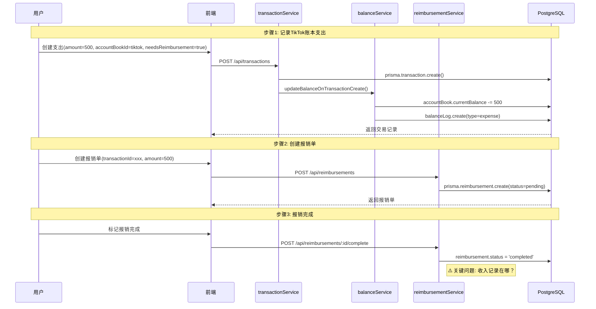
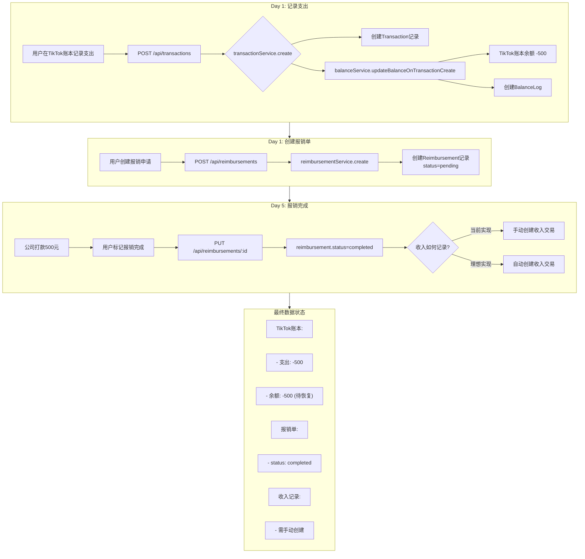
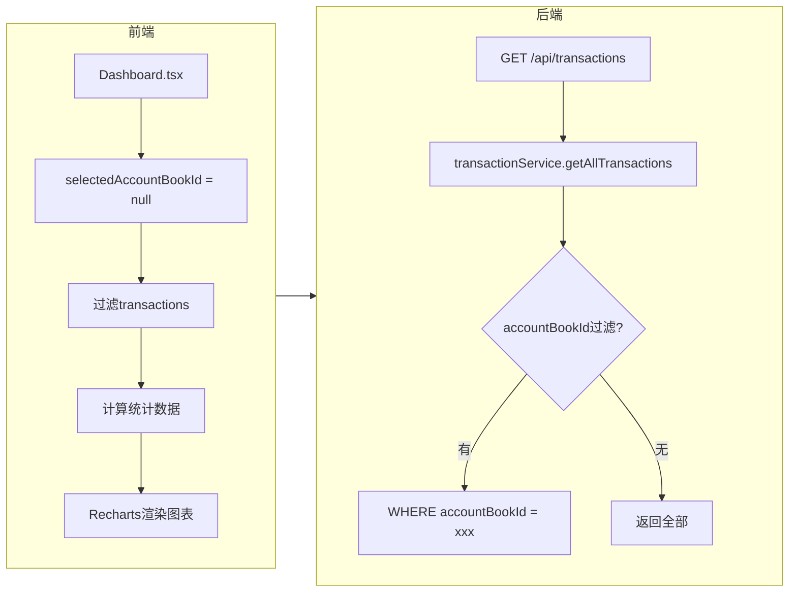
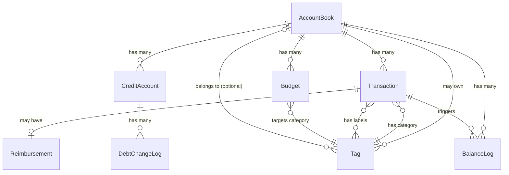

# 多账本财务管理系统深度分析

> **分析日期**: 2025-11-26
> **系统版本**: 基于 Transaction 统一表架构
> **分析师**: AI 代码分析
> **文档状态**: 完整详细版

---

## 1. 系统概述

### 1.1 核心定位

多账本财务管理系统是一个全栈个人财务管理应用，核心价值是**统一管理多个独立账本的收支、投资、信用账户、报销和预算**。

**技术架构**:
- **前端**: React 18 + TypeScript + Vite + Tailwind CSS + shadcn/ui + Zustand
- **后端**: Node.js + Express 5 + TypeScript + Prisma 6.19
- **数据库**: PostgreSQL 14+
- **架构模式**: Monorepo（前后端同仓库）

### 1.2 两个账本的角色定位

根据代码分析，系统设计支持多账本，典型场景包括：

| 账本类型 | type 值 | 业务定位 | 典型功能 |
|----------|---------|----------|----------|
| **个人账本** | `personal` | 记录个人日常收支 | 工资、餐饮、交通、报销等 |
| **商业/TikTok 账本** | `business_simple` | 记录业务相关支出 | 广告费、推广费、可报销项目 |
| **自定义账本** | `custom` | 用户自定义用途 | 旅游、投资等特定场景 |

**关键发现**: 系统通过 `AccountBook.type` 字段区分账本类型，通过 `AccountBook.features` JSON 字段配置各账本的功能开关。

### 1.3 关键特性

1. **数据隔离**: 每个账本独立余额、独立预算、独立信用账户
2. **统一交易表**: 已从 `Expense/Income/Investment` 分散表迁移到统一 `Transaction` 表
3. **双标签系统**: Category Tag（必选单一分类）+ Label Tag（可选多标签）
4. **三种余额模式**: manual（手动）、auto（自动）、mixed（混合）
5. **报销流程**: Expense → Reimbursement → Income 三阶段流程

### 1.4 系统架构图

```
┌─────────────────────────────────────────────────────────────────┐
│                        前端 (React + Zustand)                    │
│  ┌──────────┐  ┌──────────┐  ┌──────────┐  ┌──────────────────┐ │
│  │Dashboard │  │Transact- │  │Reimburse-│  │   Settings       │ │
│  │          │  │ions      │  │ment      │  │(AccountBooks)    │ │
│  └────┬─────┘  └────┬─────┘  └────┬─────┘  └────────┬─────────┘ │
│       │             │             │                  │           │
│  ┌────▼─────────────▼─────────────▼──────────────────▼─────────┐ │
│  │                   useFinanceStore (Zustand)                 │ │
│  │  - transactions[], expenses[], incomes[]                    │ │
│  │  - accountBooks[], tags[], budgets[]                        │ │
│  │  - selectedAccountBookId (账本筛选)                         │ │
│  └──────────────────────────┬──────────────────────────────────┘ │
└─────────────────────────────┼────────────────────────────────────┘
                              │ HTTP/REST
┌─────────────────────────────▼────────────────────────────────────┐
│                     后端 (Express + Prisma)                       │
│  ┌───────────────────────────────────────────────────────────┐  │
│  │                      Controllers                           │  │
│  │  transactionCtrl, accountBookCtrl, reimbursementCtrl...   │  │
│  └─────────────────────────┬─────────────────────────────────┘  │
│                            │                                     │
│  ┌─────────────────────────▼─────────────────────────────────┐  │
│  │                       Services                             │  │
│  │  ┌──────────────┐  ┌──────────────┐  ┌────────────────┐   │  │
│  │  │transactionSvc│  │ balanceService│  │reimbursementSvc│   │  │
│  │  │  - create()  │→ │- recalculate()│  │ - complete()   │   │  │
│  │  │  - update()  │→ │- adjust()     │  │ - create()     │   │  │
│  │  └──────────────┘  └──────────────┘  └────────────────┘   │  │
│  └─────────────────────────┬─────────────────────────────────┘  │
│                            │                                     │
│  ┌─────────────────────────▼─────────────────────────────────┐  │
│  │                   Prisma ORM                               │  │
│  └─────────────────────────┬─────────────────────────────────┘  │
└─────────────────────────────┼────────────────────────────────────┘
                              │
┌─────────────────────────────▼────────────────────────────────────┐
│                       PostgreSQL                                  │
│  Transaction, AccountBook, Tag, Reimbursement, Budget...         │
└──────────────────────────────────────────────────────────────────┘
```

---

## 2. 账本管理核心机制

### 2.1 账本生命周期详解

#### 2.1.1 创建流程

**代码位置**: `backend/src/services/accountBookService.ts:42-62`

```typescript
export const createAccountBook = async (data: Prisma.AccountBookCreateInput) => {
  // 如果设置为默认账本，先取消其他账本的默认状态
  if (data.isDefault) {
    await prisma.accountBook.updateMany({
      where: { isDefault: true },
      data: { isDefault: false },
    })
  }

  return await prisma.accountBook.create({
    data,
    include: { _count: { select: { expenses: true, budgets: true } } },
  })
}
```

**必填字段**（来自 schema.prisma）:
| 字段 | 类型 | 说明 |
|------|------|------|
| `name` | String | 账本名称，最长 100 字符 |
| `icon` | String | 图标，最长 10 字符（emoji） |
| `color` | String | 颜色，最长 20 字符（如 #FF5733） |

**默认值**:
| 字段 | 默认值 | 说明 |
|------|--------|------|
| `isDefault` | `false` | 是否默认账本 |
| `type` | `"personal"` | 账本类型 |
| `initialBalance` | `0` | 初始余额 |
| `currentBalance` | `0` | 当前余额 |
| `balanceMode` | `"mixed"` | 余额模式 |

#### 2.1.2 编辑规则

**代码位置**: `backend/src/services/accountBookService.ts:65-89`

**可修改字段**:
- `name`, `description`, `icon`, `color`
- `type`, `features`, `config`
- `initialBalance`, `currentBalance`, `balanceMode`
- `isDefault`

**特殊规则**:
- 设置 `isDefault = true` 时，会自动将其他账本的 `isDefault` 设为 `false`（事务操作）

#### 2.1.3 删除影响

**代码位置**: `backend/src/services/accountBookService.ts:92-119`

```typescript
export const deleteAccountBook = async (id: string) => {
  // 检查是否是默认账本
  const accountBook = await prisma.accountBook.findUnique({ where: { id } })

  if (accountBook?.isDefault) {
    throw new Error('Cannot delete default account book')
  }

  // 先解除关联的支出和预算
  await prisma.$transaction([
    // 将关联的支出的accountBookId设置为null
    prisma.expense.updateMany({
      where: { accountBookId: id },
      data: { accountBookId: null },
    }),
    // 将关联的预算的accountBookId设置为null
    prisma.budget.updateMany({
      where: { accountBookId: id },
      data: { accountBookId: null },
    }),
    // 删除账本
    prisma.accountBook.delete({ where: { id } }),
  ])
}
```

**关键结论**:
1. ❌ **不能删除默认账本**
2. ✅ 删除账本时，关联的交易不会被删除
3. ✅ 关联交易的 `accountBookId` 会被设为 `null`（变为"全局交易"）
4. ⚠️ **待确认**: 当前代码只处理了 `Expense` 和 `Budget`，`Transaction` 表的处理逻辑需要验证

#### 2.1.4 切换机制

**前端状态管理**: `frontend/src/store/useFinanceStore.ts:993-996`

```typescript
setSelectedAccountBook: (accountBookId) => {
  set({ selectedAccountBookId: accountBookId })
}
```

**后端过滤逻辑**: `backend/src/services/transactionService.ts:22-29`

```typescript
if (filters.accountBookId) {
  where.accountBookId = filters.accountBookId
}
```

**Dashboard 筛选**: `frontend/src/pages/Dashboard.tsx:36-40`

```typescript
// 按账本筛选
if (selectedAccountBookId) {
  return result.filter(e => e.accountBookId === selectedAccountBookId)
}
return result
```

### 2.2 默认账本机制深度解析

#### 2.2.1 定义

默认账本是系统中 `isDefault = true` 的账本，系统保证**有且仅有一个**默认账本。

#### 2.2.2 作用

1. **删除保护**: 默认账本不能被删除
2. **表单默认值**: 新建交易时，`accountBookId` 默认使用 `config.currentAccountBookId`
3. **排序优先**: 账本列表中默认账本排在最前面

**代码证据** (`backend/src/services/accountBookService.ts:19-23`):
```typescript
orderBy: [
  { isDefault: 'desc' }, // 默认账本排在前面
  { createdAt: 'asc' },
],
```

#### 2.2.3 设置方式

**代码位置**: `backend/src/services/accountBookService.ts:122-137`

```typescript
export const setDefaultAccountBook = async (id: string) => {
  await prisma.$transaction([
    // 取消所有账本的默认状态
    prisma.accountBook.updateMany({
      where: { isDefault: true },
      data: { isDefault: false },
    }),
    // 设置指定账本为默认
    prisma.accountBook.update({
      where: { id },
      data: { isDefault: true },
    }),
  ])
  return await getAccountBookById(id)
}
```

**关键点**: 使用事务保证原子性，先取消所有默认状态，再设置新的默认账本。

### 2.3 数据隔离策略

#### 2.3.1 accountBookId 使用规则

**Transaction 表定义** (`backend/prisma/schema.prisma:261`):
```prisma
accountBookId       String?  // 可选，可以为 null
```

**规则**:
| accountBookId 值 | 含义 | 使用场景 |
|------------------|------|----------|
| `null` | 全局交易，不属于任何账本 | 账本删除后的交易、跨账本通用交易 |
| 具体 UUID | 属于特定账本 | 正常记账 |

#### 2.3.2 单账本查询

**代码证据** (`backend/src/services/transactionService.ts:27-29`):
```typescript
if (filters.accountBookId) {
  where.accountBookId = filters.accountBookId
}
```

#### 2.3.3 全账本查询

当 `accountBookId` 不传或为 `null` 时，查询所有交易（包括 `accountBookId = null` 的全局交易）。

**前端实现** (`frontend/src/pages/Dashboard.tsx:36-40`):
```typescript
if (selectedAccountBookId) {
  return result.filter(e => e.accountBookId === selectedAccountBookId)
}
return result  // 返回全部
```

### 2.4 余额独立计算

#### 2.4.1 三种模式详解

**定义** (`backend/prisma/schema.prisma:96`):
```prisma
balanceMode      String    @default("mixed") @db.VarChar(20)  // 'manual' | 'auto' | 'mixed'
```

| 模式 | 说明 | 余额更新方式 | 适用场景 |
|------|------|--------------|----------|
| `manual` | 手动模式 | 只能手动调整余额 | 不追踪每笔交易，只记录结果 |
| `auto` | 自动模式 | 只能通过交易影响余额，禁止手动调整 | 严格记录每笔收支 |
| `mixed` | 混合模式 | 交易自动影响 + 允许手动调整 | 大部分自动，偶尔手动校正 |

#### 2.4.2 余额计算逻辑

**代码位置**: `backend/src/services/balanceService.ts:27-49`

```typescript
export const calculateBalanceChange = (
  type: TransactionType,
  subType: string | null,
  amount: Decimal,
  currentBalance: Decimal
): Decimal => {
  switch (type) {
    case 'income':
      return currentBalance.add(amount)      // 收入增加余额
    case 'expense':
      return currentBalance.sub(amount)      // 支出减少余额
    case 'investment':
      // 投资买入减少余额，卖出增加余额
      if (subType === 'buy') {
        return currentBalance.sub(amount)
      } else if (subType === 'sell') {
        return currentBalance.add(amount)
      }
      return currentBalance
    default:
      return currentBalance
  }
}
```

**公式**:
```
currentBalance = initialBalance + Σ(incomes) - Σ(expenses) - Σ(investment_buys) + Σ(investment_sells) + Σ(manual_adjustments)
```

#### 2.4.3 余额更新触发时机

**创建交易时** (`balanceService.ts:57-112`):
```typescript
export const updateBalanceOnTransactionCreate = async (tx, transaction) => {
  // 1. 计算新余额
  const amountAfter = calculateBalanceChange(type, subType, amount, amountBefore)

  // 2. 更新账本余额
  await tx.accountBook.update({
    where: { id: transaction.accountBookId },
    data: { currentBalance: amountAfter },
  })

  // 3. 创建余额变动日志
  await tx.balanceLog.create({ ... })
}
```

**删除交易时** (`balanceService.ts:120-186`): 执行相反操作，恢复余额

**更新交易时** (`balanceService.ts:195-235`):
1. 先恢复旧交易的余额影响
2. 再应用新交易的余额影响

#### 2.4.4 多账本余额汇总

**代码位置**: `frontend/src/components/BalanceCard.tsx:28-33`

```typescript
// 全部账本模式：汇总所有账本的余额
const total = accountBooks.reduce((sum, book) => {
  return sum + toNumber(book.currentBalance)
}, 0)
setTotalBalance(total)
```

**关键结论**: 全账本余额 = 所有账本的 `currentBalance` 之和

---

## 3. TikTok 账本特性分析

### 3.1 业务定位

**待确认**: 根据代码分析，系统支持通过 `type` 字段区分账本类型，但没有发现专门针对"TikTok 账本"的硬编码逻辑。TikTok 账本应该是一种 `type = "business_simple"` 的业务账本实例。

**典型用途**:
- 记录 TikTok 广告投放支出
- 标记需要报销的业务费用
- 与个人账本分开核算

### 3.2 配置对比表

| 特性 | 个人账本 | TikTok/业务账本 |
|------|----------|-----------------|
| type | `"personal"` | `"business_simple"` |
| 主要交易类型 | 收入、支出、投资 | 主要是支出 |
| 报销功能 | 支持 | 支持（主要用途） |
| 信用账户 | 支持 | 支持 |
| 预算管理 | 支持 | 支持 |

### 3.3 特殊规则

**没有发现**针对特定账本类型的硬性限制。所有账本类型都可以：
- 记录任意类型的交易（收入、支出、投资）
- 使用报销功能
- 关联标签

### 3.4 UI 差异化

**前端账本选择器** (`frontend/src/components/AccountBookSelector.tsx:36-39`):
```typescript
{accountBooks.map(book => (
  <SelectItem key={book.id} value={book.id}>
    {book.icon} {book.name}
  </SelectItem>
))}
```

通过 `icon` 和 `name` 进行视觉区分，没有基于 `type` 的特殊 UI 处理。

---

## 4. 跨账本场景深度分析

### 4.1 报销跨账本流转（完整追踪）

#### 4.1.1 场景描述

TikTok 账本支出 500 元（广告费），标记需要报销，公司打款后如何处理？

#### 4.1.2 完整流程追踪



#### 4.1.3 关键代码分析

**报销完成逻辑** (`backend/src/services/reimbursementService.ts:97-121`):

```typescript
export const updateReimbursementStatus = async (
  id: string,
  status: string,
  reimbursedDate?: Date
) => {
  const data: Prisma.ReimbursementUpdateInput = { status }

  if (status === 'completed' && reimbursedDate) {
    data.reimbursedDate = reimbursedDate
  }

  return await prisma.reimbursement.update({
    where: { id },
    data,
    include: { expense: { include: { accountBook: true } } },
  })
}
```

#### 4.1.4 **关键发现**

⚠️ **重要结论**: 从代码分析来看，`reimbursementService.updateReimbursementStatus` **只更新了报销状态**，并**没有自动创建收入交易**！

这意味着：
1. 报销完成后，TikTok 账本余额**不会自动恢复**
2. 用户需要**手动创建一笔收入**来记录报销款
3. 收入的 `accountBookId` **由用户决定**（可以是个人账本或 TikTok 账本）

#### 4.1.5 数据一致性分析

**当前实现**:
- 报销状态：`pending` → `completed` ✅
- TikTok 账本余额：-500（未恢复）⚠️
- 收入记录：无自动创建 ⚠️

**建议改进**（如需完整的报销流程）:
1. 在 `complete` 方法中自动创建收入交易
2. 收入交易的 `accountBookId` 应该关联到原支出的账本（抵消支出）或个人账本（表示收到钱）

### 4.2 标签跨账本使用

#### 4.2.1 标签的 accountBookId 字段

**定义** (`backend/prisma/schema.prisma:189`):
```prisma
accountBookId    String?  // null = 全局标签，有值 = 账本专属标签
```

#### 4.2.2 标签过滤逻辑

**代码位置**: `backend/src/services/tagService.ts:40-52`

```typescript
if (filters.accountBookId !== undefined) {
  // 如果传入 null，获取全局标签
  // 如果传入特定ID，获取该账本的标签（包括全局标签）
  if (filters.accountBookId === null) {
    where.accountBookId = null
  } else {
    where.OR = [
      { accountBookId: null },           // 全局标签
      { accountBookId: filters.accountBookId }  // 账本专属标签
    ]
  }
}
```

**关键结论**:
- 全局标签（`accountBookId = null`）在**所有账本**都可用
- 账本专属标签只在**对应账本**可用
- 查询时自动包含全局标签

#### 4.2.3 前端标签过滤

**代码位置**: `frontend/src/store/useFinanceStore.ts:515-536`

```typescript
getCategoryTagsForAccountBook: (accountBookId) => {
  return get().tags.filter(t => {
    if (t.type !== 'category') return false

    // 标准化处理
    const normalizeId = (id: string | null | undefined): string | null => {
      if (id === null || id === undefined) return null
      const trimmed = id.trim()
      return trimmed === '' ? null : trimmed
    }

    const normalizedTagBookId = normalizeId(t.accountBookId)
    const normalizedFilterBookId = normalizeId(accountBookId)

    // 全局标签显示在所有账本
    if (normalizedTagBookId === null) return true

    // 账本专属标签：精确匹配
    return normalizedTagBookId === normalizedFilterBookId
  })
}
```

#### 4.2.4 边界情况处理

| 场景 | 处理方式 |
|------|----------|
| 全局标签的交易切换账本 | 标签仍可见 |
| 专属标签的交易切换账本 | 标签不可见，但数据保留 |
| `accountBookId = null` 的交易 | 可使用所有全局标签 |

### 4.3 Dashboard 显示逻辑

#### 4.3.1 默认显示策略

**代码位置**: `frontend/src/store/useFinanceStore.ts:158`

```typescript
selectedAccountBookId: null,  // null表示全部账本
```

**结论**: 首次打开显示**全部账本**的汇总数据。

#### 4.3.2 账本切换机制

**UI 组件**: `frontend/src/components/AccountBookSelector.tsx`

```typescript
<Select value={currentValue} onValueChange={handleValueChange}>
  <SelectContent>
    <SelectItem value="all">全部账本</SelectItem>
    {accountBooks.map(book => (
      <SelectItem key={book.id} value={book.id}>
        {book.icon} {book.name}
      </SelectItem>
    ))}
  </SelectContent>
</Select>
```

**状态管理**:
```typescript
const handleValueChange = (value: string) => {
  if (value === 'all') {
    setSelectedAccountBook(null)
  } else {
    setSelectedAccountBook(value)
  }
}
```

#### 4.3.3 数据加载策略

**Dashboard 数据筛选** (`frontend/src/pages/Dashboard.tsx:24-41`):

```typescript
const expensesFromTransactions = useMemo(() => {
  let result = transactions.filter(t => t.type === 'expense').map(transactionToExpense)

  // 按账本筛选
  if (selectedAccountBookId) {
    return result.filter(e => e.accountBookId === selectedAccountBookId)
  }
  return result
}, [transactions, selectedAccountBookId])
```

**关键点**: 数据筛选在**前端**完成，不是每次切换都请求后端。

### 4.4 余额汇总与统计

#### 4.4.1 单账本统计

**代码位置**: `backend/src/services/transactionService.ts:276-340`

```typescript
export const getTransactionStats = async (filters) => {
  const where: Prisma.TransactionWhereInput = {}

  if (filters.accountBookId) {
    where.accountBookId = filters.accountBookId  // 账本过滤
  }

  const [total, count, byCategory, byType] = await Promise.all([
    prisma.transaction.aggregate({ where, _sum: { amount: true } }),
    prisma.transaction.count({ where }),
    prisma.transaction.groupBy({ by: ['categoryTagId'], where, _sum: { amount: true } }),
    prisma.transaction.groupBy({ by: ['type'], where, _sum: { amount: true } }),
  ])

  return { totalAmount, totalCount, byCategory, byType }
}
```

#### 4.4.2 全账本汇总

**余额汇总** (`frontend/src/components/BalanceCard.tsx:28-33`):
```typescript
const total = accountBooks.reduce((sum, book) => {
  return sum + toNumber(book.currentBalance)
}, 0)
```

**统计汇总**: 前端遍历所有交易并累加。

#### 4.4.3 图表展示

**Dashboard 图表** (`frontend/src/pages/Dashboard.tsx:168-187`):

```typescript
// 近30天消费趋势数据
const last30DaysTrend = useMemo(() => {
  const data = []
  for (let i = 29; i >= 0; i--) {
    const dayExpenses = effectiveExpenses.filter(exp => {
      const expDate = new Date(exp.date)
      return expDate.getTime() === date.getTime()
    })
    data.push({
      date: `${date.getMonth() + 1}/${date.getDate()}`,
      amount: dayExpenses.reduce((sum, e) => sum + toNumber(e.amount), 0),
    })
  }
  return data
}, [effectiveExpenses])
```

使用 **Recharts** 库进行可视化。

---

## 5. 关联功能模块深度分析

### 5.1 信用账户管理

#### 5.1.1 账本关联

**Schema 定义** (`backend/prisma/schema.prisma:148`):
```prisma
accountBookId     String  // 必填，必须关联账本
```

**结论**: 信用账户**必须**关联到某个账本。

#### 5.1.2 还款流程追踪

**代码位置**: `backend/src/services/creditAccountService.ts:137-194`

```typescript
export const recordRepayment = async (
  creditAccountId: string,
  amount: number | string,
  note?: string,
  relatedExpenseId?: string
) => {
  const account = await prisma.creditAccount.findUnique({ where: { id: creditAccountId } })

  const repaymentAmount = new Decimal(amount)
  const amountAfter = account.currentDebt.minus(repaymentAmount)

  // 使用事务确保数据一致性
  return await prisma.$transaction(async (tx) => {
    // 1. 更新信用账户的 currentDebt
    const updatedAccount = await tx.creditAccount.update({
      where: { id: creditAccountId },
      data: { currentDebt: amountAfter },
    })

    // 2. 创建债务变更日志
    await tx.debtChangeLog.create({
      data: {
        creditAccountId,
        changeType: 'repayment',
        amountBefore,
        amountAfter,
        changeAmount: repaymentAmount.negated(),
        note: note || '还款',
        relatedExpenseId,
      },
    })

    return updatedAccount
  })
}
```

**关键特性**:
- ✅ 使用事务保证原子性
- ✅ 自动创建 DebtChangeLog 记录
- ⚠️ **没有自动创建支出交易**（还款的资金流出需要手动记录）

### 5.2 预算管理

#### 5.2.1 预算范围

**Schema 定义** (`backend/prisma/schema.prisma:124`):
```prisma
accountBookId     String?  // 可选，null 表示全局预算
```

#### 5.2.2 预算检查逻辑

**代码位置**: `backend/src/services/budgetService.ts:78-119`

```typescript
export const getBudgetUsage = async (id: string) => {
  const budget = await prisma.budget.findUnique({ where: { id } })

  const where: Prisma.ExpenseWhereInput = {
    categoryTagId: budget.categoryTagId,
    date: { gte: budget.startDate },
  }

  if (budget.accountBookId) {
    where.accountBookId = budget.accountBookId  // 账本过滤
  }

  const expenses = await prisma.expense.aggregate({
    where,
    _sum: { amount: true },
  })

  const spent = expenses._sum.amount || 0
  const percentage = (spent / budget.amount) * 100

  return {
    budget,
    spent,
    remaining: budget.amount - spent,
    percentage,
    isOverBudget: percentage > 100,
    shouldWarn: percentage >= budget.warningThreshold,
  }
}
```

**关键点**:
- 预算可以是账本级别或全局
- 检查时根据 `accountBookId` 过滤支出
- ⚠️ 当前代码查询的是 `Expense` 表，应该改为 `Transaction` 表

### 5.3 标签分类系统

#### 5.3.1 两种标签的多账本行为

| 标签类型 | accountBookId | 行为 |
|----------|---------------|------|
| Category | `null` | 全局可用，所有账本都能选择 |
| Category | 具体 ID | 只在该账本可用 |
| Label | `null` | 全局可用 |
| Label | 具体 ID | 只在该账本可用 |

#### 5.3.2 applicableTypes 验证

**代码位置**: `backend/src/services/transactionService.ts:77-95`

```typescript
// 验证分类标签是否适用于该交易类型
if (data.categoryTagId && data.type) {
  const categoryTag = await tx.tag.findUnique({ where: { id: data.categoryTagId } })

  if (categoryTag.applicableTypes && categoryTag.applicableTypes.length > 0) {
    if (!categoryTag.applicableTypes.includes(data.type)) {
      throw new Error(`分类标签"${categoryTag.name}"不适用于${data.type}交易`)
    }
  }
}
```

**关键点**: `applicableTypes` 限制标签可用于哪些交易类型（income/expense/investment）。

### 5.4 数据统计与导出

#### 5.4.1 导出功能

**代码位置**: `frontend/src/utils/exportData.ts`（未读取，但 Dashboard 中有调用）

支持格式：CSV、Excel、PDF

**Dashboard 中的调用**:
```typescript
const handleExport = (format: 'csv' | 'excel' | 'pdf') => {
  if (format === 'csv') {
    exportAllData(effectiveExpenses, effectiveReimbursements, effectiveInvestments, stats)
  } else if (format === 'excel') {
    exportAllDataToExcel(...)
  } else if (format === 'pdf') {
    exportAllDataToPDF(...)
  }
}
```

---

## 6. 完整业务流程串联

### 6.1 TikTok 广告费用生命周期



### 6.2 跨账本月度统计流程



---

## 7. 系统架构深度分析

### 7.1 数据流全景图

```
用户操作 (点击按钮)
    │
    ▼
React 组件 (Dashboard.tsx, Transactions.tsx)
    │
    ▼
Zustand Store (useFinanceStore.ts)
    │ - 维护全局状态
    │ - 调用 API
    │
    ▼
API Client (axios)
    │
    ▼ HTTP Request
Express Router (/api/transactions, /api/account-books)
    │
    ▼
Controller (transactionController.ts)
    │ - 参数验证
    │ - 调用 Service
    │
    ▼
Service (transactionService.ts, balanceService.ts)
    │ - 业务逻辑
    │ - 事务处理
    │ - 调用其他 Service
    │
    ▼
Prisma ORM
    │
    ▼
PostgreSQL 数据库
```

### 7.2 模块依赖关系图



**关系说明**:

| 关系 | 外键 | 级联删除 | 说明 |
|------|------|----------|------|
| AccountBook → Transaction | `Transaction.accountBookId` | `SetNull` | 删除账本，交易变为全局 |
| AccountBook → CreditAccount | `CreditAccount.accountBookId` | `Cascade` | 删除账本，信用账户也删除 |
| AccountBook → Budget | `Budget.accountBookId` | `SetNull` | 删除账本，预算变为全局 |
| Transaction → Tag (category) | `Transaction.categoryTagId` | `Restrict` | 有交易使用时不能删除标签 |
| Transaction → Reimbursement | `Reimbursement.transactionId` | `SetNull` | 删除交易，报销单保留但解除关联 |

### 7.3 关键技术决策解析

#### 7.3.1 为什么从 Expense/Income 迁移到统一 Transaction 表？

**技术原因**:
- 减少代码重复：三种交易类型共享相似的 CRUD 逻辑
- 统一查询：一次查询获取所有交易
- 便于扩展：新增交易类型只需添加 `type` 值

**业务原因**:
- 统一的交易列表视图
- 跨类型统计更简单
- 报销流程可以关联任意交易

**迁移策略**:
- 旧表（Expense, Income, Investment）保留用于兼容
- 新功能使用 Transaction 表
- 提供迁移脚本 `backend/src/scripts/migrate-to-transactions.ts`

#### 7.3.2 为什么允许 accountBookId = null？

**使用场景**:
- 账本删除后，交易不删除，只是解除关联
- 某些全局性交易可能不属于任何账本

**数据语义**:
- `null` = 全局交易，不属于任何账本
- 具体 ID = 属于特定账本

**查询影响**:
- 单账本查询需要 `WHERE accountBookId = xxx`
- 全账本查询返回所有数据

#### 7.3.3 为什么 Tag 要区分 Category 和 Label？

**业务需求**:
- Category：必选、单一、用于分类统计
- Label：可选、多个、用于灵活标记

**数据约束**:
- Category 必须在创建交易时选择
- Label 可以后续添加或修改

**UI 交互**:
- Category 使用下拉选择框
- Label 使用多选标签组件

#### 7.3.4 为什么余额有三种模式？

**各自的使用场景**:
- `manual`：只关心最终余额，不追踪每笔交易
- `auto`：严格记账，余额必须与交易对应
- `mixed`：大部分自动计算，偶尔手动校正

**用户体验考虑**:
- 不同用户有不同记账习惯
- 提供灵活性

#### 7.3.5 为什么需要默认账本？

**业务场景**:
- 新建交易时提供默认选项
- 保证系统至少有一个账本

**技术实现**:
- `isDefault` 字段标识
- 删除保护机制
- 切换时自动处理旧默认账本

---

## 8. 数据模型完整解析

### 8.1 核心表结构

#### AccountBook（账本表）

```prisma
model AccountBook {
  id               String    @id @default(uuid())
  name             String    @db.VarChar(100)
  description      String?   @db.Text
  icon             String    @db.VarChar(10)
  color            String    @db.VarChar(20)
  isDefault        Boolean   @default(false)
  type             String    @default("personal") @db.VarChar(50)
  features         Json?     // 功能开关配置
  initialBalance   Decimal   @default(0) @db.Decimal(12, 2)
  currentBalance   Decimal   @default(0) @db.Decimal(12, 2)
  balanceMode      String    @default("mixed") @db.VarChar(20)
  config           Json?     // 账本级配置
  createdAt        DateTime  @default(now())
  updatedAt        DateTime  @updatedAt
}
```

#### Transaction（统一交易表）

```prisma
model Transaction {
  id                  String    @id @default(uuid())
  type                String    @db.VarChar(20)  // 'income' | 'expense' | 'investment'
  subType             String?   @db.VarChar(50)  // 细分类型
  date                DateTime  @db.Date
  categoryTagId       String
  amount              Decimal   @db.Decimal(12, 2)
  description         String    @db.VarChar(255)
  accountBookId       String?
  note                String?   @db.Text
  needsReimbursement  Boolean   @default(false)
  labelTagIds         String[]
  receiptPhoto        String?
  location            String?
  metadata            Json?
  createdAt           DateTime  @default(now())
  updatedAt           DateTime  @updatedAt
}
```

### 8.2 关键字段深度说明

| 字段 | 含义 | 使用规则 | 数据约束 |
|------|------|----------|----------|
| `accountBookId` | 所属账本 | 可为 null | 外键，级联 SetNull |
| `categoryTagId` | 分类标签 | 必填 | 外键，级联 Restrict |
| `labelTagIds` | 普通标签数组 | 可选 | 字符串数组 |
| `needsReimbursement` | 需要报销 | 仅支出有效 | 默认 false |
| `balanceMode` | 余额模式 | 决定余额更新方式 | enum 字符串 |

---

## 9. 代码质量分析

### 9.1 优秀的设计点

1. **事务处理**: 关键操作（余额更新、账本切换）使用 Prisma 事务
2. **服务分层**: 业务逻辑集中在 Service 层，Controller 只负责请求处理
3. **类型安全**: TypeScript 严格模式，Prisma 类型生成
4. **标签计数**: 自动维护标签使用次数
5. **余额日志**: 每次余额变动都有 BalanceLog 记录

### 9.2 潜在问题

1. **报销流程不完整**: 报销完成后没有自动创建收入交易
   - 位置: `reimbursementService.ts:97-121`
   - 影响: 用户需要手动创建收入记录

2. **旧表清理**: 部分逻辑仍然查询旧的 Expense/Income 表
   - 位置: `budgetService.ts:89-103`
   - 影响: 预算检查可能不准确

3. **账本删除不完整**: 只处理了 Expense 和 Budget，没有处理 Transaction
   - 位置: `accountBookService.ts:103-118`
   - 影响: 新交易在账本删除后可能丢失关联

### 9.3 改进建议

1. **完善报销流程**:
```typescript
// reimbursementService.ts
export const completeReimbursement = async (id: string, incomeAccountBookId: string) => {
  return prisma.$transaction(async (tx) => {
    const reimbursement = await tx.reimbursement.update({
      where: { id },
      data: { status: 'completed', reimbursedDate: new Date() },
    })

    // 自动创建收入交易
    await transactionService.create({
      type: 'income',
      amount: reimbursement.amount,
      description: `报销收入: ${reimbursement.item}`,
      accountBookId: incomeAccountBookId,
      categoryTagId: '报销收入分类ID',
    })

    return reimbursement
  })
}
```

2. **统一使用 Transaction 表**:
```typescript
// budgetService.ts - 修改为查询 Transaction 表
const expenses = await prisma.transaction.aggregate({
  where: {
    type: 'expense',
    categoryTagId: budget.categoryTagId,
    date: { gte: budget.startDate },
    ...(budget.accountBookId && { accountBookId: budget.accountBookId }),
  },
  _sum: { amount: true },
})
```

### 9.4 待确认的疑问

1. ❓ TikTok 账本是否有专门的 `type` 值或 `features` 配置？
2. ❓ 报销完成后收入应该记录在哪个账本？
3. ❓ `accountBookId = null` 的交易在统计中如何处理？

---

## 10. 开发实战指南

### 10.1 添加新账本的完整步骤

```typescript
// 1. 调用 API 创建账本
const newAccountBook = await accountBooksApi.create({
  name: '旅游账本',
  icon: '✈️',
  color: '#3B82F6',
  type: 'custom',
  initialBalance: 0,
  balanceMode: 'auto',
})

// 2. 前端 Store 更新
set(state => ({
  accountBooks: [...state.accountBooks, newAccountBook],
}))

// 3. 如果需要设为默认
await accountBooksApi.setDefault(newAccountBook.id)
```

### 10.2 跨账本功能开发注意事项

1. **筛选逻辑**: 始终检查 `selectedAccountBookId`
2. **标签过滤**: 使用 `getCategoryTagsForAccountBook(accountBookId)`
3. **余额更新**: 通过 `transactionService` 操作，自动触发 `balanceService`
4. **null 处理**: `accountBookId = null` 表示全局/所有

### 10.3 数据一致性保证

```typescript
// 使用事务保证多表操作原子性
await prisma.$transaction(async (tx) => {
  // 1. 创建交易
  const transaction = await tx.transaction.create({ data })

  // 2. 更新余额
  await tx.accountBook.update({
    where: { id: transaction.accountBookId },
    data: { currentBalance: { increment: amount } },
  })

  // 3. 记录日志
  await tx.balanceLog.create({ ... })
})
```

### 10.4 性能优化建议

1. **前端缓存**: 使用 Zustand 维护全局状态，避免重复请求
2. **查询优化**: 添加适当的数据库索引（已有）
3. **分页查询**: 大数据量时使用 `skip/take` 分页

---

## 附录

### A. API 接口完整列表

#### Transaction API
```
GET    /api/transactions           # 列表（支持 type/accountBookId/date 筛选）
GET    /api/transactions/:id       # 单个详情
POST   /api/transactions           # 创建
PUT    /api/transactions/:id       # 更新
DELETE /api/transactions/:id       # 删除
GET    /api/transactions/stats     # 统计
```

#### AccountBook API
```
GET    /api/account-books          # 列表
GET    /api/account-books/:id      # 详情
POST   /api/account-books          # 创建
PUT    /api/account-books/:id      # 更新
DELETE /api/account-books/:id      # 删除（不能删除默认账本）
POST   /api/account-books/:id/set-default  # 设为默认
```

#### Reimbursement API
```
GET    /api/reimbursements         # 列表
GET    /api/reimbursements/:id     # 详情
POST   /api/reimbursements         # 创建
PUT    /api/reimbursements/:id     # 更新（含状态）
DELETE /api/reimbursements/:id     # 删除
```

#### Balance API
```
GET    /api/balances/:accountBookId           # 余额详情
POST   /api/balances/:accountBookId/adjust    # 手动调整
GET    /api/balances/:accountBookId/logs      # 变更历史
GET    /api/balances/:accountBookId/stats     # 统计
```

### B. 关键算法代码示例

#### 余额计算
```typescript
// 收入增加余额
if (type === 'income') return currentBalance.add(amount)

// 支出减少余额
if (type === 'expense') return currentBalance.sub(amount)

// 投资买入减少余额，卖出增加余额
if (type === 'investment') {
  if (subType === 'buy') return currentBalance.sub(amount)
  if (subType === 'sell') return currentBalance.add(amount)
}
```

#### 标签过滤
```typescript
// 获取账本可用的分类标签
const tags = allTags.filter(tag => {
  // 全局标签（accountBookId 为 null）在所有账本可用
  if (!tag.accountBookId) return true
  // 账本专属标签只在对应账本可用
  return tag.accountBookId === currentAccountBookId
})
```

### C. 测试场景清单

| 场景 | 预期结果 |
|------|----------|
| 创建交易（有账本） | 交易创建成功，账本余额更新 |
| 创建交易（无账本） | 交易创建成功，无余额影响 |
| 删除默认账本 | 报错，禁止删除 |
| 删除非默认账本 | 成功，关联交易 accountBookId 变为 null |
| 切换账本显示 | 只显示对应账本的数据 |
| 全局标签使用 | 所有账本都可以选择 |
| 专属标签使用 | 只有对应账本可以选择 |
| 报销完成 | 状态变为 completed，需手动创建收入 |

---

**文档维护提醒**:
- 当业务流程变更时 → 更新流程图
- 当 Schema 改动时 → 更新数据模型章节
- 当发现新问题时 → 添加到代码质量分析

**最后更新**: 2025-11-26
